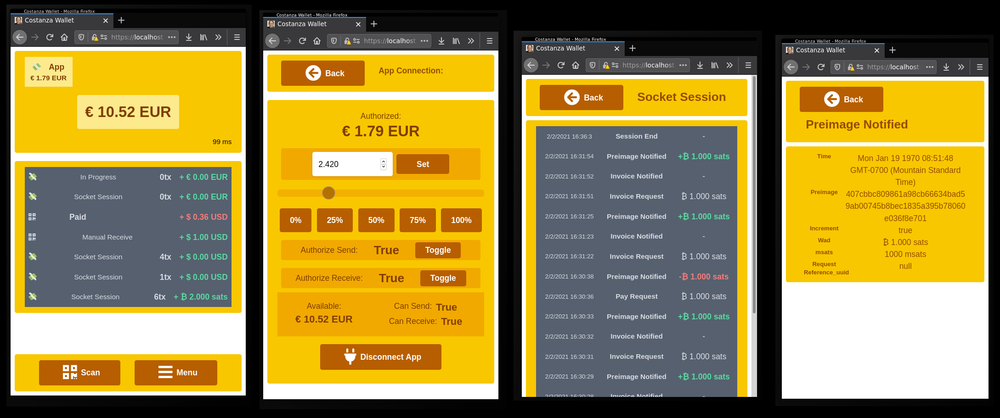

# Introduction

[Moneysocket](https://socket.money) is is a protocol and system for applications to connect to other applications via a full-duplex pipe and coordinate over paying bolt11s via the Lightning Network. It is designed to allow fast and frequent settlement of small automated payments with minimal human intervention from the user.

## How it works:

QR Codes are only slightly less of a pain than credit cards and a non-starter for micro-payments. The moneysocket protocol removes this issue by creating application specific wallets that can freely trade hltcs with the app. For instance, this is a screenshot from [costanza](https://github.com/moneysocket/costanza/blob/main/img/interface.png):

_Note: a more detailed explanation is available in the [architecture section](architecture.md)_

## Libraries:

This library is based off of the two moneysocket reference implementations:

- [js-moneysocket](https://github.com/moneysocket/js-moneysocket): All of our end-to-end integration tests are based pretty heavily on this library with different stacks meant to simulate this behavior. A useful byproduct of writing our integration tests in this way is being able to use golang as an app server at some point in the future for interacting with moneysocket
- [py-moneysocket](https://github.com/moneysocket/py-moneysocket): The original implementation and the basis of terminus, relay, and stabled

There are a list of other implementations [here](https://github.com/moneysocket/awesome-moneysocket/blob/main/README.md), but since the goal of this documentation is go these are thh most relevant.

## Installation

It's highly recommended you build from source while this app is highly unstable, but you can download releases [here](https://github.com/xplorfin/moneysocket-go/releases). You can also pull the docker container [here](https://github.com/orgs/xplorfin/packages/container/package/moneysocket-go%2Fmoneysocket-go)

## Lightning Network/Bitcoin client

Currently, the golang implementation only targets [lnd](https://github.com/lightningnetwork/lnd) 0.11.0, but you can add other implementations by submitting a [pull request](https://github.com/xplorfin/moneysocket-go/compare). You can install lnd from the [release page](https://github.com/lightningnetwork/lnd/releases/latest) by following [these instructions](https://github.com/lightningnetwork/lnd/blob/master/docs/INSTALL.md). Alternatively, you can use [umbrel](https://getumbrel.com/) for an easier install experience. If you are developing and need to easily test between two or more nodes, [polar](https://github.com/jamaljsr/polar) may be useful. 

## Usage

Please see the [getting started guide](getting-started.md) for details on setting up.